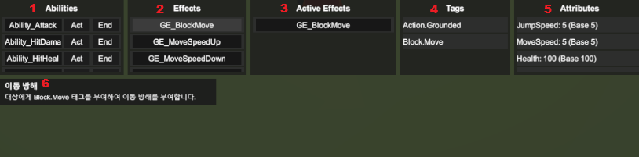

# GameAbilitySystem 플러그인

## 개요
GameAbilitySystem은 Unity용 Gameplay Ability System(GAS) 스타일 플러그인입니다.
Domain(순수 C#)과 Presentation(Unity)을 분리해 Host 환경에서도 재사용할 수 있도록 설계했습니다.

## 핵심 특징
- **순수 C# Domain 모델**: Unity 의존성 없이 Host/서버에서 동작
- **Presentation 분리**: Unity 컴포넌트/ScriptableObject/디버그 UI 제공
- **태그/효과 기반 설계**: 태그 조건, 지속/주기/즉시 효과 지원
- **타게팅 전략 분리**: Target/Strategy 구조로 확장 가능

## 레이어 구성
### Domain
- AbilitySystemComponent(모델), Attribute/Tag/Effect/Ability 등 순수 로직
- 스레드 안전 처리(락 기반)
- 스냅샷은 불변 복사본으로 제공

### Presentation
- Unity 씬과 연결되는 컴포넌트/어댑터
- ScriptableObject 기반 설정(능력/효과/태그)
- 입력/타게팅/디버그 UI 등 표현 계층 역할

## 기본 사용 흐름
1. 태그/속성/효과/능력 정의를 ScriptableObject로 구성합니다.
2. AbilitySystemComponentAdapter로 Domain 모델을 생성/연결합니다.
3. 이벤트/입력으로 능력을 활성화합니다.

```csharp
// Ability 부여
var handle = abilitySystem.GiveAbility(abilityDefinition);

// Ability 실행
abilitySystem.TryActivateAbility(handle);
```

## 폴더 구조
```
Runtime/
├── Domain/        # 순수 C# 모델/로직
├── Presentation/  # Unity 컴포넌트 및 SO/디버그
├── Tag/           # 태그 유틸/레지스트리
├── Target/        # 타게팅 데이터/전략
├── Task/          # AbilityTask 구현
└── Util/          # 공용 유틸
```

## 샘플 Play Video
### [Youtube Url](https://youtu.be/4lewfMLXdOE)

1. 등록 된 능력 목록을 노출합니다. 클릭 시 해당 능력을 부여 합니다. 부여 된 대상은 녹색으로 하이라이트가 됩니다.
2. 등록 된 효과 목록을 노출합니다. 클릭 시 해당 효과를 부여 합니다. 부여 된 대상은 녹색으로 하이라이트가 됩니다.
3. 부여 된 효과가 노출됩니다. 클릭 시 해당 효과를 제거합니다.
4. 부여 된 태그가 노출됩니다. 클릭 시 해당 태그를 제거합니다.
5. 대상의 현재 속성 값을 노출합니다.
6. 목록 요소들을 마우스 오버 시 해당 내용에 대한 설명 툴팁을 제공합니다.

## 참고
- Domain 레이어는 Unity 의존이 없어 Host/서버 환경에서도 사용 가능합니다.
- Presentation 레이어는 Unity 오브젝트와 에디터 기능을 포함합니다.
- 자세한 API는 문서 사이트를 참고하세요.
